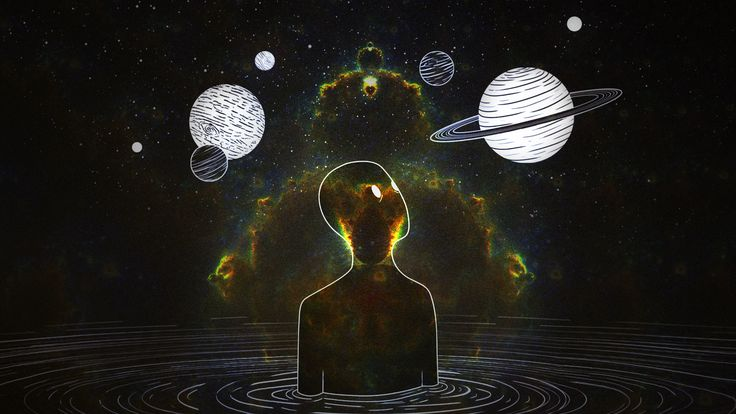

<!-- ===================== COSMIC BANNER ===================== -->

<p align="center">
  
</p>

<br>

<h1 align="center">🌌 Disha Pandey</h1>

<p align="center">
  <b>Artificial Intelligence & Machine Learning • Exploring Space AI</b>
</p>

<p align="center">
  
</p>

<p align="center">
  <a href="https://github.com/disha-p21">
    
  </a>
  <a href="https://www.linkedin.com/in/disha-pandey-120a24230/">
    
  </a>
  <a href="mailto:dishapandey696@gmail.com">
    
  </a>
</p>

---

# 💫 About Me

Hi! I'm **Disha Pandey**, a B.Tech student specializing in **Artificial Intelligence and Machine Learning**.

I'm passionate about building intelligent systems and exploring how AI can be applied to real-world problems.

My interests include:

- 🤖 Artificial Intelligence
- 🧠 Machine Learning & Deep Learning
- 👁️ Computer Vision
- ✨ Generative AI
- 🗣️ NLP & Large Language Models
- 🔎 Retrieval-Augmented Generation (RAG)
- 🔄 MLOps
- ☁️ Cloud AI
- 🌌 Space AI & Autonomous Systems

My long-term goal is to work at the intersection of **Artificial Intelligence and Space Technology**, exploring applications such as autonomous systems, satellite intelligence, aerospace technologies, Earth observation, and intelligent mission-critical systems.

> 🌌 **Learning AI on Earth, dreaming beyond the cosmos.**

---


# 💻 Tech Stack

### 👩‍💻 Programming

<p>
  
  
  
  
  
  
</p>

### 🧠 AI / Machine Learning

<p>
  
  
  
  
  
  
  
</p>

### ✨ Generative AI / NLP

<p>
  
  
  
  
</p>

### 🌐 Development

<p>
  
  
  
  
  
  
</p>

### ☁️ Cloud / Tools / Databases

<p>
  
  
  
  
  
  
  
</p>

<p>
  
  
  
  
  
  
</p>

---


# 📚 Currently Learning

```text
🧠 Advanced Machine Learning
   └── Improving model development & evaluation

🤖 Deep Learning
   └── Neural networks & advanced architectures

👁️ Computer Vision
   └── Image understanding & intelligent vision systems

✨ Generative AI
   └── LLMs, multimodal AI & AI applications

🔎 RAG
   └── Retrieval + Generation systems

🔄 MLOps
   └── Building & deploying reliable ML systems

☁️ Cloud AI
   └── Google Cloud & Vertex AI

🛰️ Autonomous AI
   └── Intelligent decision-making systems
```

---

# 🌌 Future: Space AI

One of my biggest interests is exploring how Artificial Intelligence can contribute to **space and aerospace technology**.

Areas that interest me include:

- 🛰️ Satellite Intelligence
- 🌍 Earth Observation
- 👁️ Satellite Image Analysis
- 🤖 Autonomous Systems
- 🧭 Intelligent Navigation
- 🔎 Anomaly Detection
- 📡 Space Communication
- 🧠 AI-assisted Mission Systems
- 🚀 Aerospace Applications


# 📊 GitHub Analytics

<p align="center">
  
  &nbsp;&nbsp;
  
</p>

---

# 🌐 Connect With Me

<p align="center">

<a href="https://github.com/disha-p21">
  
</a>

<a href="https://www.linkedin.com/in/disha-pandey-120a24230/">
  
</a>

<a href="https://instagram.com/disha_.core">
  
</a>

<a href="mailto:dishapandey696@gmail.com">
  
</a>

</p>

---

# 🌌 Final Transmission

<p align="center">

```text
                         ✦
              ✧                  ✦
        ✦            🌌              ✧
                    .    .
             🪐                ✨
                    ☄️
        ✧                         ✦

              KEEP LEARNING.
              KEEP BUILDING.
              KEEP EXPLORING.

                    🌌
```

### 🌌 Exploring Intelligence Beyond Earth.

<p align="center">
  <b>✨ Learn • Build • Explore • Repeat ✨</b>
</p>

---

<p align="center">
  <i>Thanks for visiting my corner of the universe.</i> 🌌
</p>
